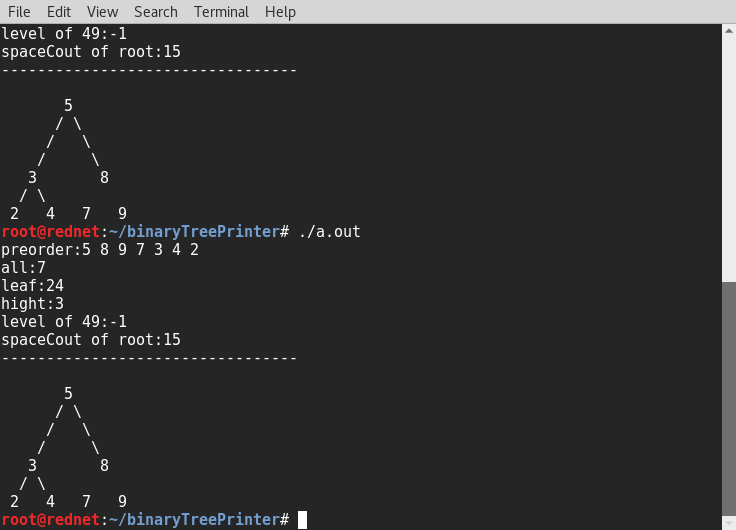

 binaryTreePrinter 
======================

example of planned output of tree

```
       5
      / \
     /   \
    /     \
   3       8
  / \
 2   4   7   9

```


# to do list
- [x] code the tree it self
- [x] make try basic printing
- [x] prepare standar tesing tree
- [ ] try more advanced ones
- [ ] refine the code
